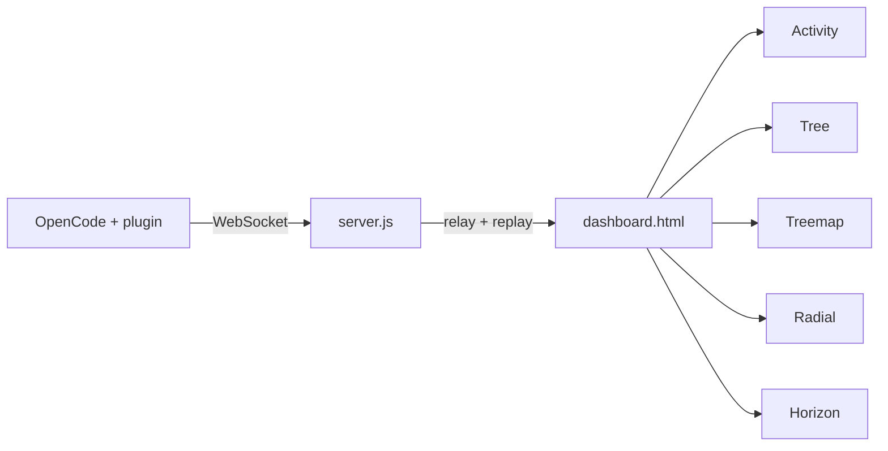

# Agent Live Monitor

A real-time visualization dashboard for [OpenCode](https://opencode.ai) agents. Watch file activity, project structure, and per-prompt timelines while the agent works.

## What it does

The monitor runs as a small local server plus an OpenCode plugin. The plugin observes agent hooks (reads, edits, tools, prompts) and streams JSON events over WebSocket. The browser dashboard shows five synchronized views in tabs, each tuned for a different way to see the same session.

## Quick start

```bash
npm install
npm start
```

Open [http://localhost:8765/](http://localhost:8765/)

Install the plugin (see [OpenCode plugin](#opencode-plugin)), restart OpenCode, then run an agent in a project. Tabs update live.

Or run without cloning:

```bash
npx opencode-agent-live-monitor
```

## Dashboard tabs

| Tab | URL | Description |
|-----|-----|-------------|
| **Activity** | `/explorer` | Active files by folder, agent status, activity log |
| **Tree** | `/tree` | Horizontal D3 tree — full project index, pan/zoom, activity capsules |
| **Treemap** | `/treemap` | Drill-down treemap; gray = untouched; click files for preview |
| **Radial** | `/radial` | Radial cluster of the project tree with activity highlights |
| **Horizon** | `/horizon` | Per-prompt activity timeline; start/end markers; freezes when done |

## Features by view

### Activity
- Recent files grouped by directory with action badges
- Live activity log and agent status (running / complete + summary)

### Tree
- Full project tree on connect (same index as treemap), not only visited paths
- Folders expand as the agent reads; click to collapse
- Colored capsule outlines on files/dirs being read, edited, or written
- Pan (drag) and zoom; auto-frames active nodes during agent work

### Treemap
- Full-project index on startup; cells reset to gray on each new prompt
- Color by action (read, edit, list, glob, grep); flash labels on activity
- Drill into folders; click a file for a text preview popover (`GET /preview`)

### Radial
- Same live tree data as Tree in a radial cluster layout
- Full index on connect; capsule/ring highlights for current activity

### Horizon
- One timeline **per prompt**: violet **Prompt start** line when a prompt begins
- Timeline advances live while the agent runs
- Sky **Prompt complete** line when the session finishes; timeline **stops** (frozen)
- Next prompt clears and starts a new segment
- Rows grouped by directory; mirrored horizon bands colored by action (1s bins)

## Project layout

```
AICodeEditorMonitor/
├── server.js                 # HTTP + WebSocket relay, state cache, /preview API
├── dashboard.html            # Tab shell (iframes)
├── index.html                # Activity (active files + log)
├── index-tree.html           # Tree view
├── index-treemap.html        # Treemap view
├── index-radial.html         # Radial cluster view
├── index-horizon.html        # Horizon chart view
├── monitor-tree.js           # Shared tree clone/merge helpers
├── monitor-highlights.js     # Activity flash highlights (Tree + Radial)
├── live-monitor-plugin.js    # OpenCode plugin (copy to ~/.config/opencode/plugins/)
├── bin/opencode-agent-live-monitor.js
├── index.js                  # npm package entry
├── package.json
└── README.md
```

## Tech stack

- **Frontend**: HTML, [Tailwind CSS](https://tailwindcss.com) (CDN), [D3.js](https://d3js.org) v7
- **Server**: Node.js, [`ws`](https://github.com/websockets/ws)
- **Integration**: OpenCode plugin hooks (`tool.execute.*`, `message.updated`, `session.idle`, etc.)

## OpenCode plugin

### Option A — Local file (recommended for development)

```bash
cp live-monitor-plugin.js ~/.config/opencode/plugins/
```

Restart OpenCode after any plugin change.

### Option B — npm plugin (when published)

Add to `opencode.json`:

```json
{
  "plugin": ["opencode-agent-live-monitor"]
}
```

### Connection

| Variable | Default |
|----------|---------|
| `AICODE_MONITOR_WS_URL` | `ws://localhost:8765` |
| `OPENCODE_MONITOR_WS_URL` | (same) |

The dashboard server must be running before OpenCode connects.

## WebSocket messages

| Type | Purpose |
|------|---------|
| `project_index` | Full project file tree (gray baseline) |
| `update` | Tree snapshot + active files + log lines |
| `session_reset` | Reset visited colors; new prompt on treemap/horizon |
| `agent_status` | `prompt_submitted`, `working`, `complete` + optional summary (UI only; dashboard popover uses `session_idle`) |
| `activity_event` | Timestamped file action for Horizon |
| `activity_batch` | Replay recent `activity_event`s on browser connect |
| `file_progress` | Active write path for treemap spinner |
| `status` | Plugin connected / waiting / `session_idle` (true prompt end — drives “Prompt complete” popover) |

### Example `activity_event`

```json
{
  "type": "activity_event",
  "path": "src/foo.ts",
  "dir": "src",
  "name": "foo.ts",
  "action": "read",
  "at": 1710000000000
}
```

Actions include `read`, `edit`, `list`, `glob`, `grep`, `write`.

## How it works



1. The plugin builds a project tree, scans the repo for `project_index`, and emits events on tool use and prompt lifecycle.
2. `server.js` relays messages between the plugin and all connected browsers and caches the latest state for new tabs.
3. Each view is a standalone page loaded in an iframe with its own handlers.

## Configuration

Constants in `live-monitor-plugin.js` (keep in sync with views where noted):

| Flag | Effect |
|------|--------|
| `SHOW_GLOBS` | Show glob tool activity on treemap (default: off) |
| `RESET_VISITED_ON_PROMPT` | Gray treemap + reset horizon segment on new user prompt |

Horizon (`index-horizon.html`): `MAX_FILES` (default 80 active file rows).

## File preview API

```
GET /preview?path=relative/path/to/file
```

Returns up to 8KB of UTF-8 text. Requires `projectRoot` from a prior `project_index` or `session_reset` message.

## License

ISC
