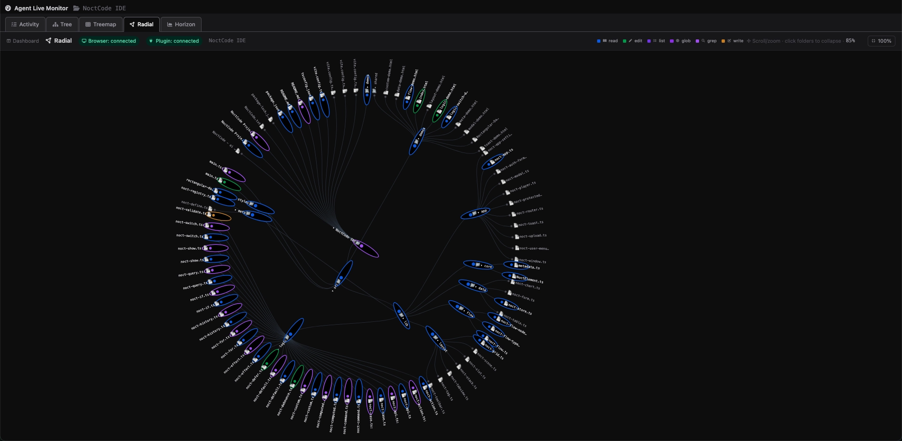
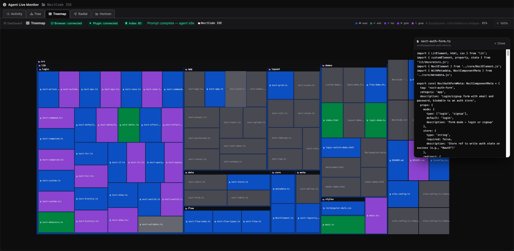
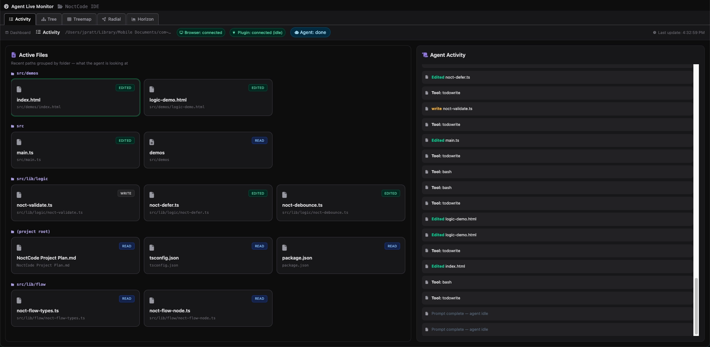
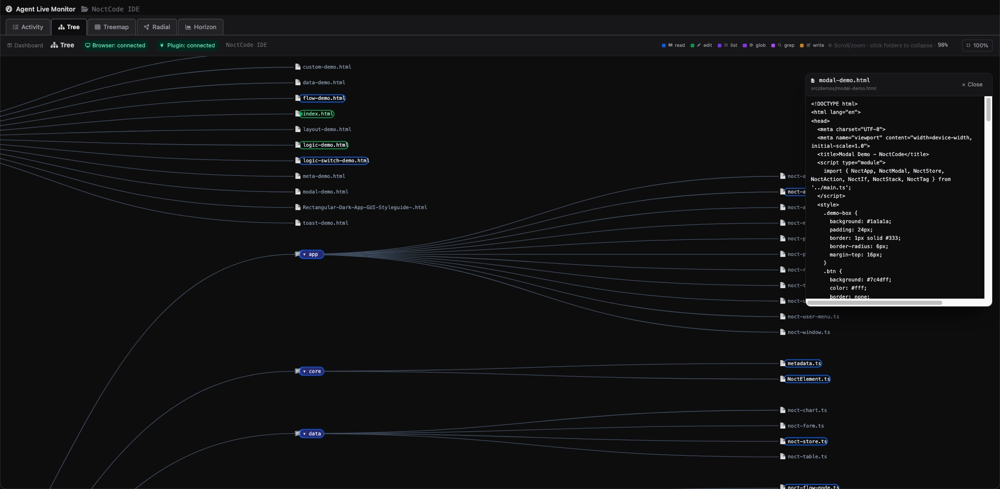
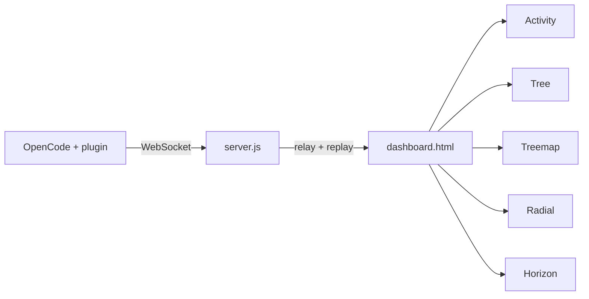

# Agent Live Monitor

A real-time visualization dashboard for [OpenCode](https://opencode.ai) agents. Watch file activity, project structure, and per-prompt timelines while the agent works.  Zoom in and out on charts, click files to preview their contents.  

## What it does

The monitor runs as a small local server plus an OpenCode plugin. The plugin observes agent hooks (reads, edits, tools, prompts) and streams JSON events over WebSocket. The browser dashboard shows five synchronized views in tabs, each tuned for a different way to see the same session.  It fits the workflow better on a second widescreen display while opencode is used on the main display.

<table>
  <tr>
    <td align="center"><a href="img/view-radialTree.webp"></a></td>
    <td align="center"><a href="img/view-treeMap.webp"></a></td>
    <td align="center"><a href="img/view-activityView.webp"></a></td>
    <td align="center"><a href="img/view-tree.webp"></a></td>
  </tr>
</table>   


## Quick start

```bash
npm install
npm start
```

Open [http://localhost:8765/](http://localhost:8765/)

Install the plugin (see [OpenCode plugin](#opencode-plugin)), restart OpenCode, then run an agent in a project. Tabs update live.

Or run without cloning:

```bash
npx opencode-agent-live-monitor
```

## Auto-start on login

The dashboard server must be running before OpenCode connects. On any OS you can keep it up with **`npm start`** (stable) or **`npm run start:watch`** (restarts when `server.js` changes). Plugin changes still require an OpenCode restart.

Replace `/path/to/AICodeEditorMonitor` below with your clone directory (the folder that contains `package.json`).

### macOS (launchd)

Install a user LaunchAgent from the repo:

```bash
# Recommended during development: auto-reload on server.js changes
npm run launchd:install -- --watch

# Stable mode (no file watching)
npm run launchd:install -- --stable
```

Useful commands:

```bash
npm run launchd:restart    # restart after config changes
npm run launchd:logs       # tail launchd logs
npm run launchd:uninstall  # remove LaunchAgent
```

Logs:

- `~/Library/Logs/aicodeeditor-monitor.log`
- `~/Library/Logs/aicodeeditor-monitor.err.log`

In `--watch` mode, server code changes restart automatically.

### Linux (systemd user service)

Create a user unit (no root required):

```bash
mkdir -p ~/.config/systemd/user
```

Edit `~/.config/systemd/user/aicodeeditor-monitor.service`:

```ini
[Unit]
Description=OpenCode Agent Live Monitor
After=network-online.target
Wants=network-online.target

[Service]
Type=simple
WorkingDirectory=/path/to/AICodeEditorMonitor
ExecStart=/usr/bin/env npm run start
# ExecStart=/usr/bin/env npm run start:watch   # dev: reload server.js on change
Restart=on-failure
RestartSec=5

[Install]
WantedBy=default.target
```

Enable and start:

```bash
systemctl --user daemon-reload
systemctl --user enable --now aicodeeditor-monitor.service
```

Useful commands:

```bash
systemctl --user status aicodeeditor-monitor
systemctl --user restart aicodeeditor-monitor
journalctl --user -u aicodeeditor-monitor -f
systemctl --user disable --now aicodeeditor-monitor.service
```

**Headless or SSH-only login:** user services may stop when you log out unless lingering is enabled:

```bash
loginctl enable-linger "$USER"
```

If `npm` is not on systemd’s PATH, set `ExecStart` to the full path from `which npm` (for example `ExecStart=/home/you/.nvm/versions/node/v22/bin/npm run start`).

### Windows (Task Scheduler)

Run at sign-in from **PowerShell** or **Command Prompt** (adjust paths):

```powershell
$repo = "C:\path\to\AICodeEditorMonitor"
schtasks /Create /TN "AICodeEditor Monitor" /SC ONLOGON /RL LIMITED `
  /TR "cmd.exe /c cd /d `"$repo`" && npm run start" /F
```

For watch mode during development, use `npm run start:watch` in the `/TR` command instead.

Other commands:

```powershell
schtasks /Run /TN "AICodeEditor Monitor"
schtasks /End /TN "AICodeEditor Monitor"
schtasks /Delete /TN "AICodeEditor Monitor" /F
```

**GUI alternative:** Task Scheduler → Create Task → trigger **At log on** → action **Start a program** → Program `cmd.exe`, arguments `/c cd /d C:\path\to\AICodeEditorMonitor && npm run start`, start in `C:\path\to\AICodeEditorMonitor`.

**Notes:**

- Use the same environment where `npm` works (Node from [nodejs.org](https://nodejs.org/) or nvm-windows). If the task fails silently, run the `/TR` command manually once to confirm.
- Task Scheduler does not rotate logs; run from a terminal when debugging, or redirect output in the task action if you need a log file.

## Dashboard tabs

| Tab | URL | Description |
|-----|-----|-------------|
| **Activity** | `/explorer` | Active files by folder, agent status, activity log |
| **Tree** | `/tree` | Horizontal D3 tree — full project index, pan/zoom, activity capsules |
| **Treemap** | `/treemap` | Drill-down treemap; gray = untouched; click files for preview |
| **Radial** | `/radial` | Radial cluster of the project tree with activity highlights |
| **Horizon** | `/horizon` | Per-prompt activity timeline; start/end markers; freezes when done |

## Features by view

### Activity

<a href="img/view-activityView.webp"></a>

- Recent files grouped by directory with action badges
- Live activity log and agent status (running / complete + summary)

### Tree

<a href="img/view-tree.webp"></a>

- Full project tree on connect (same index as treemap), not only visited paths
- Folders expand as the agent reads; click to collapse
- Colored capsule outlines on files/dirs being read, edited, or written
- Pan (drag) and zoom; auto-frames active nodes during agent work

### Treemap

<a href="img/view-treeMap.webp"></a>

- Full-project index on startup; cells reset to gray on each new prompt
- Color by action (read, edit, list, glob, grep); flash labels on activity
- Drill into folders; click a file for a text preview popover (`GET /preview`)

### Radial

<a href="img/view-radialTree.webp"></a>

- Same live tree data as Tree in a radial cluster layout
- Full index on connect; capsule/ring highlights for current activity

### Horizon
- One timeline **per user prompt** (not per subtask/tool round): **Prompt start** on `prompt_submitted` / `session_reset`
- Timeline advances live while the agent runs
- **Prompt complete** when the plugin’s debounced `session_idle` fires (whole run idle ~3.5s); timeline **freezes**
- Next top-level user message clears and starts a new segment
- Rows grouped by directory; mirrored horizon bands colored by action (1s bins)

## Project layout

```
AICodeEditorMonitor/
├── server.js                 # HTTP + WebSocket relay, state cache, /preview API
├── dashboard.html            # Tab shell (iframes)
├── index.html                # Activity (active files + log)
├── index-tree.html           # Tree view
├── index-treemap.html        # Treemap view
├── index-radial.html         # Radial cluster view
├── index-horizon.html        # Horizon chart view
├── monitor-tree.js           # Shared tree clone/merge helpers
├── monitor-highlights.js     # Activity flash highlights (Tree + Radial)
├── live-monitor-plugin.js    # OpenCode plugin (copy to ~/.config/opencode/plugins/)
├── bin/opencode-agent-live-monitor.js
├── index.js                  # npm package entry
├── package.json
└── README.md
```

## Tech stack

- **Frontend**: HTML, [Tailwind CSS](https://tailwindcss.com) (CDN), [D3.js](https://d3js.org) v7
- **Server**: Node.js, [`ws`](https://github.com/websockets/ws)
- **Integration**: OpenCode plugin hooks (`tool.execute.*`, `message.updated`, `session.idle`, etc.)

## OpenCode plugin

### Option A — Local file (recommended for development)

```bash
cp live-monitor-plugin.js ~/.config/opencode/plugins/
```

Restart OpenCode after any plugin change.

### Option B — npm plugin (when published in the future)

Add to `opencode.json`:

```json
{
  "plugin": ["opencode-agent-live-monitor"]
}
```

### Connection

| Variable | Default |
|----------|---------|
| `AICODE_MONITOR_WS_URL` | `ws://localhost:8765` |
| `OPENCODE_MONITOR_WS_URL` | (same) |

The dashboard server must be running before OpenCode connects.

## WebSocket messages

| Type | Purpose |
|------|---------|
| `project_index` | Full project file tree (gray baseline) |
| `update` | Tree snapshot + active files + log lines |
| `session_reset` | Reset visited colors; new prompt on treemap/horizon |
| `agent_status` | `prompt_submitted` (top-level user message only), `working`, `complete` + optional summary |
| `activity_event` | Timestamped file action for Horizon |
| `activity_batch` | Replay recent `activity_event`s on browser connect |
| `file_progress` | Active write path for treemap spinner |
| `status` | Plugin connected / waiting / `session_idle` (debounced whole-prompt end — Horizon markers + dashboard popover) |

**Prompt boundaries (plugin):** `message.updated` with role `user` starts a run only when the message is top-level (not a subagent `parentID` session), not `synthetic`, and not a task-tool injection. `session.status` / `session.idle` with `idle` end the run after **3.5s** of sustained idle (`AICODE_MONITOR_IDLE_DEBOUNCE_MS`), cancelled by `busy`/`retry` or any `tool.execute.before`. OpenCode fires `session.idle` after each agent-loop iteration, not only when the full user prompt is done.

### Example `activity_event`

```json
{
  "type": "activity_event",
  "path": "src/foo.ts",
  "dir": "src",
  "name": "foo.ts",
  "action": "read",
  "at": 1710000000000
}
```

Actions include `read`, `edit`, `list`, `glob`, `grep`, `write`.

## How it works



1. The plugin builds a project tree, scans the repo for `project_index`, and emits events on tool use and prompt lifecycle.
2. `server.js` relays messages between the plugin and all connected browsers and caches the latest state for new tabs.
3. Each view is a standalone page loaded in an iframe with its own handlers.

## Configuration

Constants in `live-monitor-plugin.js` (keep in sync with views where noted):

| Flag | Effect |
|------|--------|
| `SHOW_GLOBS` | Show glob tool activity on treemap (default: off) |
| `RESET_VISITED_ON_PROMPT` | Gray treemap + reset horizon segment on new user prompt |

Horizon (`index-horizon.html`): `MAX_FILES` (default 80 active file rows).

## File preview API

```
GET /preview?path=relative/path/to/file
```

Returns up to 8KB of UTF-8 text. Requires `projectRoot` from a prior `project_index` or `session_reset` message.

## License

ISC
